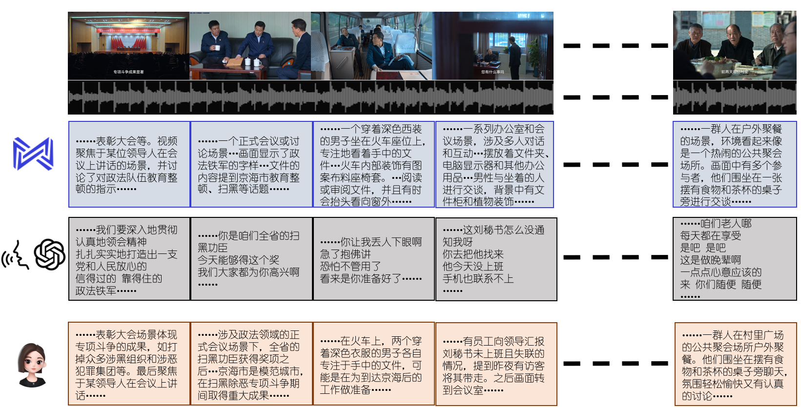

# 视频剧情总结

事实上，这只是“计算机视觉”研究生课程中一个简单的课程项目。课程项目的要求是，根据电视剧《狂飙》的第一二集，提出一个计算机视觉任务，如在交通场景中跟踪车辆等。

当老师介绍完这个课程项目，自然而然地，他邀请同学们思考，我们可以做一个什么样的项目。

那第一位幸运同学也是自然而然地说，我们可以总结视频内容。

然而，老师提出了他的质疑，即便2024年的大模型恐怖如斯，但是视频理解仍然是个无法触碰的课题。

然而，我提出了我的质疑，我不认为这一定要是个研究课题，这可以只是个简单的工程问题。

## 项目要求

todo

## 项目实现




## 使用

考虑到本项目中使用了本地运行的面壁小钢炮视觉大模型，和本地运行的OpenAI Whisper语音转文本模型，请确保本地至少有20G的显存，C盘或/home至少有35G空间

并且，考虑到语言模型调用了豆包大模型，请根据[火山引擎文档](https://www.volcengine.com/docs/82379/1302008)，将自己的API加入环境变量，将模型接入点（形似 `"ep-xxxxxxxxx"`）插入到`src/model.py`中的`Doubao`中

1. 使用`video_process.py`处理视频。在处理之前，请自行定位视频的开头标题和结尾演职员表，并填入`video_process.py`中的`OP_TIME`和`ED_TIME`处，以便删除
```bash 
python -m src.video_process
```
2. 运行pipeline
```bash
python -m src.pipeline --output_dir output
```
运行结束后，会在输出文件夹得到一个csv文件，包含了四列内容：视频caption、字幕、根据视频caption和字幕的片段总结，和根据当前片段和过往语境的当前语境总结

